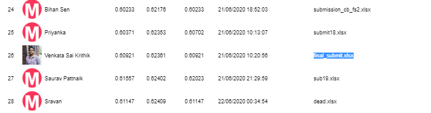
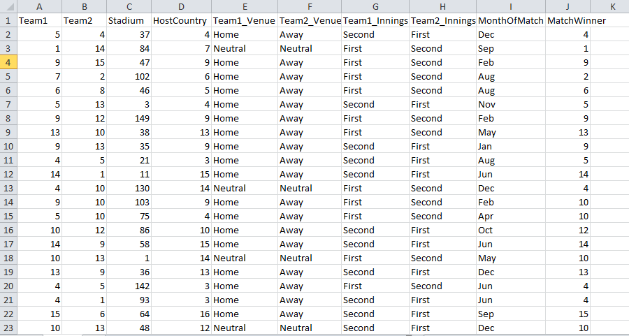

# ODI-Match-Winner-Weekend-Hackathon
**Rank 26 Solution for ODI Match Winner** \
-------------------------------------
Given the daily sales of a grocery shop recorded over a period of almost 2 years, your objective as a data scientist is to build a machine learning model that can forecast the sales for the upcoming 3 months.
### Leader Board:

### Data Description:-
The unzipped folder will have the following files.
- Train.csv –  2293 observations.
- Test.csv –  983 observations.
- Sample Submission – Sample format for the submission.
## Data at a Glance

#### Feature Engineering & Approach
1. Added New features such as who wins at most, win percent when Team 1 played with Team 2 and Team 1 got 1st Innings, etc.
2. Used CatboostClassifier for final modeling.
3. Ensembled with LGBMClassifier.
#### Tools used
1. Python for programming
2. sklearn and numpy libraries for methodology
3. lightgbm,catboost libraries for the model
4. matplotlib and seaborn was used for plotting and analyzing the data
#### Competition Result
Rank: 26th on public LB and 26th on private LB\
[Link to LeaderBoard](https://www.machinehack.com/course/odi-match-winner-weekend-hackathon-9/leaderboard)

     
